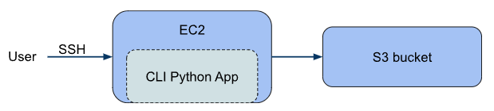
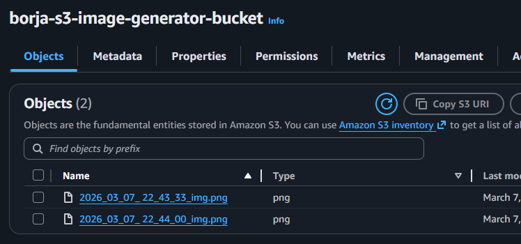

# AWS-image-generator

## Introduction
This project exlores how AWS can be used to generate and store (potentially) many files, while avoiding local storage. 

For the scope of the project:
- File generation was a toy example that produces images with different patterns
- A single user was used.

## Architecture

 

## Services Used
- S3 for image storage
- EC2 for image generation and user interaction
- IAM for security basics

## Workflow
Users will connect to EC2 instance through SSH, and use Linux shell to execute the Python based CLI app stored in the instance. That appaccepts parameters to produce different images. 
Once generated, the images will be moved to an S3 bucket for storage and deleted from EC2. After some time, images will be deleted from S3 too.

## Deployment
Instructions to reproduce the project can be found in docs subfolder.

## Results
S3 bucket after using CLI App twice:

Example of output image:

## Possible improvements
- The shell script used to set up the EC2 instance doesn't fully work, so some things were fixed manually. The problem was with either pip or pip3
- If more users were added, the code that produces filenames should be adapted to avoid overwriting files
- The project as it is lacks scalability

## Author

Borja Gandón
